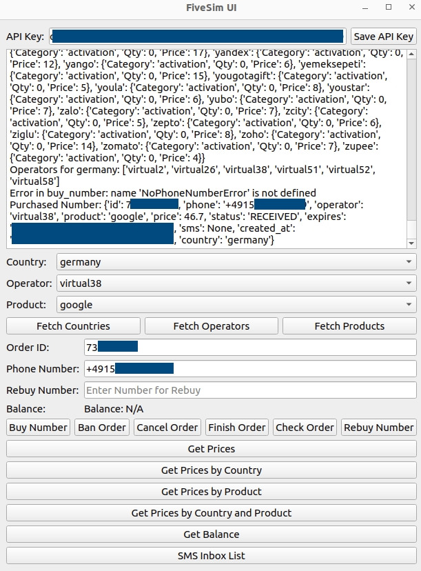

# 5Sim API Client & GUI

## **Overview**
This repository contains a **Python client** for the **5Sim API**, along with a **PyQt5 GUI** that provides an interactive interface for managing phone number activations and orders.

The client module supports various **API endpoints**, such as:
- Fetching countries, products, and balance
- Executing order management tasks: **buying, canceling, checking orders**
- Dynamically updating GUI components (e.g., updating operators based on selected country)
- Logging **real-time API responses and errors** for easy debugging



## **Features**
✅ **API Client** – A lightweight wrapper for interacting with the 5Sim API.  
✅ **Interactive GUI** – Built with **PyQt5**, allowing easy management of orders, fetching data, and updating the UI dynamically.  
✅ **Real-Time Logging** – Displays API responses and errors instantly.  
✅ **Order Management** – Easily **buy, ban, cancel, finish, check, and rebuy orders**.  
✅ **Balance Display** – Retrieve and display your **account balance** automatically.

---

## **Installation**

### **1. Clone the Repository**
```bash
git clone https://github.com/enescingoz/5sim_ui.git
cd 5sim_ui
```

### **2. Install Dependencies**
Install the necessary packages manually:
```bash
pip3 install requests PyQt5 fivesim
```

---

## **Usage**

### **Run the Application**
```bash
python3 main.py
```

### **Set Your API Key**
- Enter your **5Sim API key** in the provided textbox at the top of the GUI.
- Click **Save API Key** to initialize the client.

### **Interact with the GUI**
- Click **Fetch Countries** to load available countries; the **operator list updates automatically**.
- Use the order management buttons:
  - **Buy Number**
  - **Ban Order**
  - **Cancel Order**
  - **Finish Order**
  - **Check Order**
  - **Rebuy Number**
- Click **Get Balance** to retrieve and display your **current account balance**.
- Additional buttons allow fetching **products and pricing information**.

---
